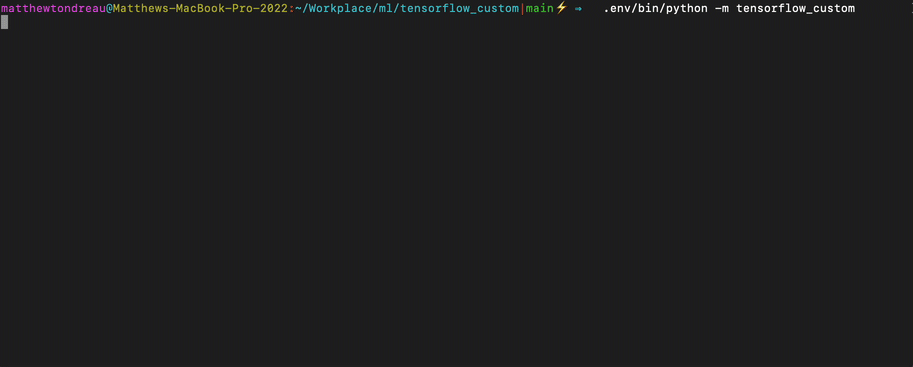
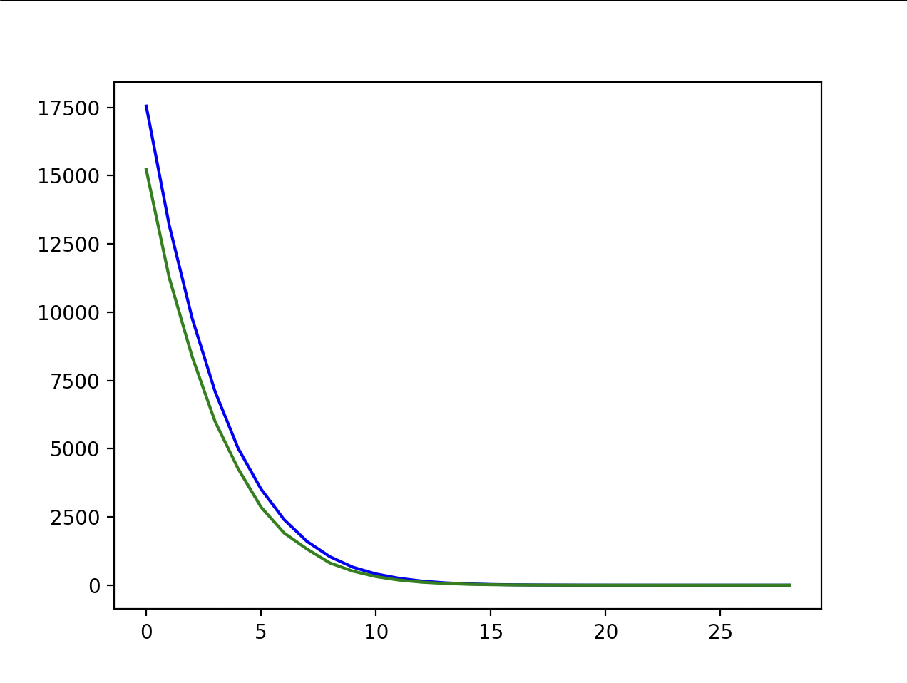
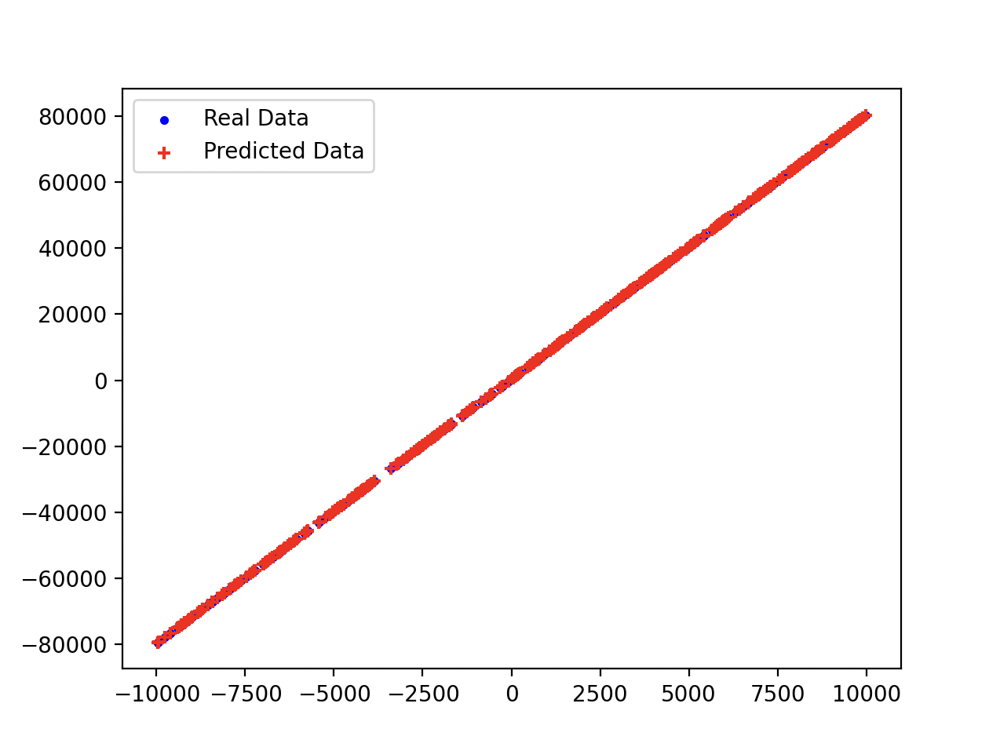

# Custom Tensorflow

This project demonstrates some of the customizations that can be performed with tensorflow. Specifically showcasing:

- Custom Training
  - Epoch and Batch Loop
  - Interacting with callbacks
  - Applying gradients
  - Custom progress bar (tqdm)
- Custom Layer
  - LinearLayer
- Custom Loss
  - HubberLoss
  - LeaseSquareError

# Setup

conda env create -f environment.yml --prefix ./.env

# Run

```
.env/bin/python -m tensorflow_custom
```

# Demo

### Training Loop



### Loss Plot



### Test Predictions Plot


